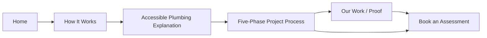

# Decision: Route Explanation Through How It Works Before Assessment

**Status:** Current  
**Date:** 2026-09-09  
**Scope:** Wave 1 navigation, homepage routing, How It Works, assessment conversion

## Decision

`How It Works` is an explanatory destination in the first-draft site architecture.

Visitors who select **See How It Works** or the homepage **How it works** route must be taken to `/how-it-works/`, not directly to the assessment form.

The page should explain both:

1. the five-phase Plumbing Track project process; and
2. the accessible-plumbing idea that makes the installation method different from simply replacing pipe and burying the replacement system again.

Assessment remains available after the explanation as a conversion action, alongside proof such as Our Work.

## Why

The previous homepage route collapsed education and conversion into the same action:

```text
How It Works → Book an Assessment
```

That asks a visitor to submit project information before the site has finished explaining what Plumbing Track actually does and why its accessible routing matters.

The preferred sequence is:



Assessment is still visible and easy to reach, but it is no longer substituted for the explanatory destination.

## Wave placement

This decision promotes the high-level `/how-it-works/` page into **Wave 1**.

Wave 2 retains the deeper child material, including:

- `/how-it-works/installation/`;
- detailed installation photography and step-by-step technical process;
- the deeper Technology / Accessible Plumbing page;
- Conventional vs Plumbing Track comparison content.

The Wave 1 How It Works page should therefore explain enough of accessible plumbing to make the process understandable without cannibalizing the later technical deep dive.

## Implementation mapping

- Homepage hero **See How It Works** → `/how-it-works/`
- Homepage **How it works** exploration card → `/how-it-works/`
- Primary navigation How It Works flyout → `/how-it-works/`
- Project Process flyout → `/how-it-works/#process`
- `/how-it-works/` → accessible-plumbing explanation + five-phase process
- `/how-it-works/` downstream CTAs → Our Work and Book an Assessment

## Relationship to existing planning

This decision refines the earlier design-plan flow where the high-level process could route directly to Assessment. The underlying architecture remains valid; only the conversion order changes.

The current rule is:

> **Explain the system and process first. Ask for the building second.**
