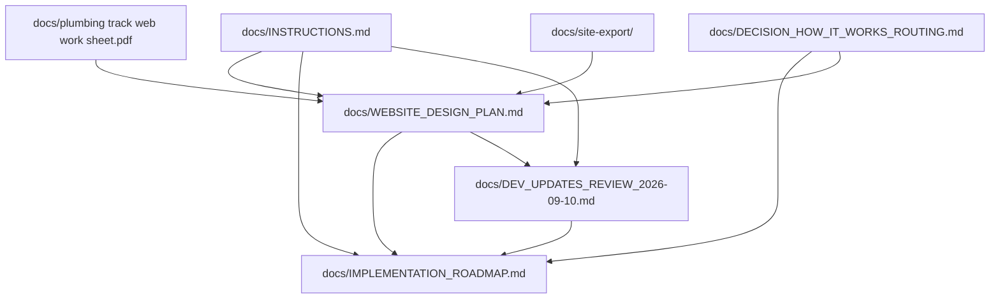

# Plumbing Track Documentation Index

This directory is the human-readable planning and source layer for `pt-site-updates`.

Grapher records should reference these paths rather than duplicating full documents into semantic entries. The stable IDs below are the intended graph identities for documentation-level records.

| Grapher ID | Path | Role | Current status |
|---|---|---|---|
| `docs-instructions` | `docs/INSTRUCTIONS.md` | Governing implementation instructions and source precedence | Current |
| `docs-website-design-plan` | `docs/WEBSITE_DESIGN_PLAN.md` | Target website architecture and design plan | Current |
| `docs-implementation-roadmap` | `docs/IMPLEMENTATION_ROADMAP.md` | Living execution status and Wave rebaseline | Current |
| `docs-dev-updates-review` | `docs/DEV_UPDATES_REVIEW_2026-09-10.md` | Source-level branch review: strengths, defects, route status, production gates, and plan re-evaluation | Current |
| `docs-decision-how-it-works-routing` | `docs/DECISION_HOW_IT_WORKS_ROUTING.md` | Current routing decision: explain before assessment | Current |
| `docs-web-work-sheet` | `docs/plumbing track web work sheet.pdf` | Earlier source / supporting website worksheet | Source evidence |
| `docs-site-export` | `docs/site-export/` | Archived Squarespace material | Historical source evidence |

## Documentation relationships

## Current precedence inside `docs/`

For current implementation decisions:

1. explicit current operator decisions recorded in a current decision document;
2. `docs/INSTRUCTIONS.md`;
3. `docs/IMPLEMENTATION_ROADMAP.md` for current implementation/wave status;
4. `docs/DEV_UPDATES_REVIEW_2026-09-10.md` for the evidence and reasoning behind the current branch rebaseline;
5. `docs/WEBSITE_DESIGN_PLAN.md` for target architecture and design intent;
6. source/supporting documents and archived exports.

This local ordering does not replace the broader source-precedence rules in `docs/INSTRUCTIONS.md`; it clarifies how tracked project documentation relates to itself.

## Current implementation note

The 2026-09-10 review confirms that About, Solutions, Poly-B, Kitec, Occupied Building Repiping, Detailed Installation, Technology, Accessible Plumbing, comparison, Resources, and FAQ routes now exist as first-draft implementations. Their former unchecked route-creation tasks have been reclassified to hardening/content-depth work in the roadmap.

Problem Guides, Decision Guides, Project Guides, focused educational articles, and the individual project-proof library remain deliberately later-wave work and must not be treated as cancelled merely because they are absent from the first-draft menu.

## Current routing note

`How It Works` remains a Wave 1 explanatory page. Homepage and navigation entry points route to `/how-it-works/`; Assessment is a downstream conversion action rather than the destination used to explain the process.

See `docs/DECISION_HOW_IT_WORKS_ROUTING.md`.
