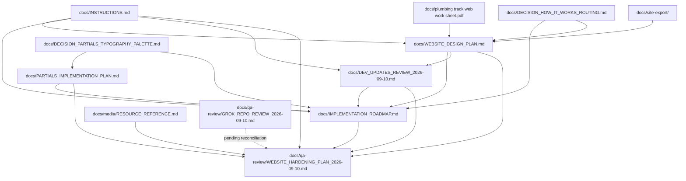

# Plumbing Track Documentation Index

This directory is the human-readable planning and source layer for `pt-site-updates`.

Grapher records should reference these paths rather than duplicating full documents into semantic entries. The stable IDs below are the intended graph identities for documentation-level records.

| Grapher ID | Path | Role | Current status |
|---|---|---|---|
| `docs-instructions` | `docs/INSTRUCTIONS.md` | Governing implementation instructions and source precedence | Current |
| `docs-website-design-plan` | `docs/WEBSITE_DESIGN_PLAN.md` | Target website architecture and design plan | Current |
| `docs-implementation-roadmap` | `docs/IMPLEMENTATION_ROADMAP.md` | Living execution status and Wave rebaseline | Current |
| `docs-dev-updates-review` | `docs/DEV_UPDATES_REVIEW_2026-09-10.md` | Source-level branch review: strengths, defects, route status, production gates, and plan re-evaluation | Current |
| `docs-partials-implementation-plan` | `docs/PARTIALS_IMPLEMENTATION_PLAN.md` | Safe staged migration from runtime fragments to Ruby/ERB build-time partials | Current |
| `docs-decision-partials-typography-palette` | `docs/DECISION_PARTIALS_TYPOGRAPHY_PALETTE.md` | Operator decisions: build-time partials, Geist retained, cyan remains removed | Current |
| `docs-decision-how-it-works-routing` | `docs/DECISION_HOW_IT_WORKS_ROUTING.md` | Current routing decision: explain before assessment | Current |
| `docs-media-resource-reference` | `docs/media/RESOURCE_REFERENCE.md` | Curated website media handoff, priority assets, placement guidance, and evidence/privacy limits | Current reference |
| `docs-grok-review-2026-09-10` | `docs/qa-review/GROK_REPO_REVIEW_2026-09-10.md` | Advisory Grok QA intake and reconciliation record | Raw source pending |
| `docs-hardening-plan-2026-09-10` | `docs/qa-review/WEBSITE_HARDENING_PLAN_2026-09-10.md` | Follow-up production hardening plan covering delivery, SEO, funnel, GA4, CRM, media, and QA | Draft current |
| `docs-web-work-sheet` | `docs/plumbing track web work sheet.pdf` | Earlier source / supporting website worksheet | Source evidence |
| `docs-site-export` | `docs/site-export/` | Archived Squarespace material | Historical source evidence |

## Documentation relationships

## Current precedence inside `docs/`

For current implementation decisions:

1. explicit current operator decisions recorded in a current decision document;
2. `docs/INSTRUCTIONS.md`;
3. `docs/IMPLEMENTATION_ROADMAP.md` for current implementation/wave status;
4. dedicated implementation plans such as `docs/PARTIALS_IMPLEMENTATION_PLAN.md`;
5. `docs/DEV_UPDATES_REVIEW_2026-09-10.md` for the evidence and reasoning behind the current branch rebaseline;
6. `docs/WEBSITE_DESIGN_PLAN.md` for target architecture and design intent;
7. source/supporting documents and archived exports.

QA-review documents do not silently override this order. `docs/qa-review/WEBSITE_HARDENING_PLAN_2026-09-10.md` is a draft execution plan that reconciles the current sources; `docs/qa-review/GROK_REPO_REVIEW_2026-09-10.md` remains advisory and raw-source-pending until the actual Grok text is supplied.

This local ordering does not replace the broader source-precedence rules in `docs/INSTRUCTIONS.md`; it clarifies how tracked project documentation relates to itself.

## Current shared-chrome / typography / palette decision

The runtime fragment loader is scheduled to be replaced by **build-time rendered partials**. The first implementation must preserve all current public paths, generate into an isolated `dist/` directory, and pass parity verification before deployment changes. See `docs/PARTIALS_IMPLEMENTATION_PLAN.md`.

**Geist remains the canonical site typeface.**

**Cyan remains intentionally removed.** Any remaining `--cyan` / `--cyan-soft` references are stale artifacts to remove or replace with the current palette rather than reasons to restore cyan.

See `docs/DECISION_PARTIALS_TYPOGRAPHY_PALETTE.md`.

## Current implementation note

The 2026-09-10 review confirms that About, Solutions, Poly-B, Kitec, Occupied Building Repiping, Detailed Installation, Technology, Accessible Plumbing, comparison, Resources, and FAQ routes now exist as first-draft implementations. Their former unchecked route-creation tasks have been reclassified to hardening/content-depth work in the roadmap.

Problem Guides, Decision Guides, Project Guides, focused educational articles, and the individual project-proof library remain deliberately later-wave work and must not be treated as cancelled merely because they are absent from the first-draft menu.

## Current QA / hardening note

`docs/qa-review/WEBSITE_HARDENING_PLAN_2026-09-10.md` turns the existing P0/P1 review findings into a follow-up execution plan. Its priority is production hardening before further route sprawl: build-time delivery, technical SEO, lead-funnel reliability, GA4 event-contract cleanup, privacy-safe behavioral profiling, CRM attribution/persistence, curated proof media, and full browser/accessibility/performance QA.

The companion Grok intake file records that the raw Grok review was not actually present in the handoff message or connected sources. It must be reconciled when supplied rather than reconstructed from memory or inferred from overlap.

## Current media reference

`docs/media/RESOURCE_REFERENCE.md` indexes the September 2026 curated media handoff. It is the reference for priority website photos/video, recommended page placement, review limitations, privacy checks, and claim-evidence boundaries. Media should strengthen the existing **Problem → System → Proof → Action** journey without replacing the homepage hero video or manufacturing project/material/future-access claims.

## Current routing note

`How It Works` remains a Wave 1 explanatory page. Homepage and navigation entry points route to `/how-it-works/`; Assessment is a downstream conversion action rather than the destination used to explain the process.

See `docs/DECISION_HOW_IT_WORKS_ROUTING.md`.
