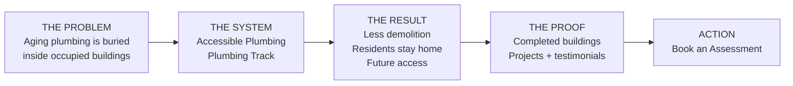
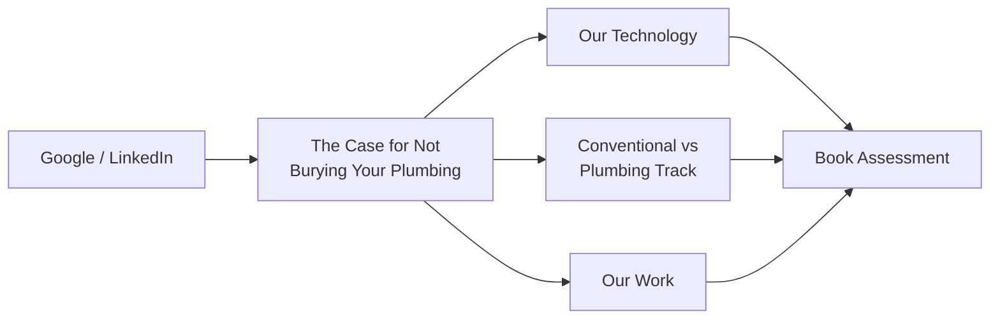
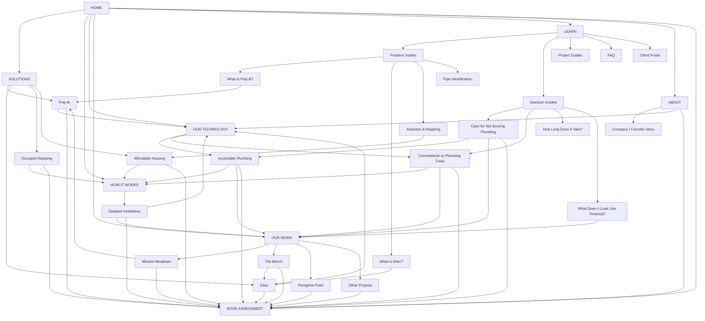

# Plumbing Track Website Design Plan

## Status and source basis

This document is the implementation design plan for the Plumbing Track website overhaul. It incorporates the current Marketing → Website Changes material, including the Home, Process, Our Work, Affordable Housing, Resources, About Us, Book an Assessment, strategy workbook, and the article **The Case for Not Burying Your Plumbing**.

The information architecture and content flow are being overhauled. **The existing website identity is not.**

---

## 1. Non-negotiable visual direction

### Continue the existing `pt-site-updates` aesthetic

The visual language already implemented in this repository is the design baseline for the overhaul.

This project is **not a rebrand or aesthetic reset**.

New and revised pages must:

- retain the current typography, color system, spacing language, visual tone, imagery treatment, navigation feel, and component styling;
- extend existing components and patterns wherever practical rather than creating a competing design system;
- make new pages such as Our Technology, Solutions, individual project pages, and Learn feel native to the existing site;
- style new architectural diagrams, comparison graphics, project cards, filters, and explanatory components to fit the existing aesthetic;
- improve responsive behavior where necessary without changing the site's visual identity.

### Preserve the homepage video

The existing video that plays on the homepage is a deliberate part of the site's identity and **must remain**.

It should continue to function as a major visual element in the opening/hero experience. It must not be silently replaced with a static hero image as part of the overhaul.

The homepage should therefore begin approximately as:

```text
[ EXISTING HOMEPAGE VIDEO / HERO EXPERIENCE ]

Poly-B & Kitec Repiping for Multifamily Buildings

Repipe the building.
Leave the ceilings alone.

[ Book an Assessment ] [ See How It Works ]
```

The rule for implementation is:

> **Redesign the site's architecture and content flow; preserve and extend the existing site's aesthetic and homepage video experience.**

---

## 2. Core site story

The site should communicate three ideas in sequence:

**Problem → System → Proof**



The deeper product thesis is **accessible plumbing**.

Conventional repiping solves the immediate material problem but normally buries the replacement system again. Plumbing Track changes the architecture of the system itself: routing becomes deliberate, installation happens in the open, and future access is designed into the building.

The existing benefits — occupied-building installation, reduced demolition, reduced restoration, finished appearance, and future serviceability — should be presented as consequences and proof of that central idea rather than as an unrelated list of claims.

---

## 3. Primary navigation

```text
HOME

SOLUTIONS
  Poly-B Replacement
  Kitec Replacement
  Occupied Building Repiping
  Affordable Housing

HOW IT WORKS
  Project Process
  Detailed Installation

OUR TECHNOLOGY
  Accessible Plumbing
  Conventional vs Plumbing Track

OUR WORK
  Project Portfolio
  Individual Projects

LEARN
  Problem Guides
  Decision Guides
  Project Guides
  FAQ
  Client Portal

ABOUT

[ BOOK AN ASSESSMENT ]
```

`Our Technology` is a first-class section. The About page should not carry the entire burden of explaining the product.

---

## 4. Overall page design principles

- Prefer focused, indexable pages over epic scrolling pages.
- Each page should answer one primary question.
- Home should route visitors rather than contain the entire website.
- Use real buildings and real finished Plumbing Track installations instead of generic plumbing imagery wherever source material permits.
- Design mobile-first while preserving the existing visual identity.
- Use a clear hierarchy: **headline → proof → explanation → related evidence → CTA**.
- Avoid excessive cards and visual clutter.
- Keep **Book an Assessment** persistent and easy to reach.
- Every commercial/informational page should normally offer two next steps: learn/prove something and book an assessment.

---

# 5. Home

Home is a routing and positioning page, not the entire sales brochure.

## Opening / hero

**Preserve the existing homepage video.**

Suggested content hierarchy around the existing video experience:

**Eyebrow:**

> Poly-B & Kitec Repiping for Multifamily Buildings

**Headline direction:**

> Repipe the building. Leave the ceilings alone.

Supporting copy should establish:

- occupied multifamily buildings;
- the accessible Plumbing Track system;
- reduced demolition;
- residents staying in their homes;
- a finished architectural result.

Primary CTA: **Book an Assessment**

Secondary CTA: **See How It Works**

## Accessible-plumbing thesis

Immediately after the opening experience:

### Plumbing shouldn't disappear just because the project is finished.

Introduce the idea of accessible plumbing in a very short section.

Suggested comparison concept:

```text
CONVENTIONAL                     PLUMBING TRACK

New Pipe                         New Pipe
   ↓                                ↓
Buried in structure              Planned accessible route
   ↓                                ↓
Cannot readily inspect           Service access
   ↓                                ↓
Future problem                   Future problem
   ↓                                ↓
Open building again              Access system
```

This graphic must be styled to match the current site rather than introducing a new visual language.

## Primary benefits

Four concise benefits:

1. **Residents stay home**
2. **Less of the building gets opened**
3. **Future access is built in**
4. **Finished as part of the building**

Link to **Why accessible plumbing matters** rather than adding long explanatory copy to Home.

## Process preview

Show only the five project phases:

1. Assessment
2. Preparing the Building & Residents
3. Installation
4. Finished Result
5. Future Access

Then: **See the full process →**

## Featured work

Feature strong projects such as Mission Meadows, The Bench, and Peregrine Point where the source data is verified.

Each card should show only useful decision-making information such as image, pipe material, unit count, location, and a defining verified result.

Each links to an individual project page.

## Social proof

Show several testimonials/proof elements without forcing the visitor to wait through a one-at-a-time carousel.

Use recognizable client/property logos only where permission and source material support them.

## Service area

Compact section covering Calgary, Kelowna, and surrounding service areas as confirmed by current marketing material.

## Final CTA

> **Find out what your building needs.**

→ Book an Assessment

---

# 6. Solutions

The Solutions hub routes visitors based on the problem they already know they have.

```text
Solutions
├── Poly-B Replacement
├── Kitec Replacement
├── Occupied Building Repiping
└── Affordable Housing
```

These pages should not be four copies of the same sales page.

## Poly-B Replacement

Material/problem-driven page.

Structure:

- what the Poly-B problem is;
- building/ownership risk;
- Plumbing Track replacement approach;
- occupied-building/disruption advantage;
- relevant projects;
- relevant FAQ;
- assessment CTA.

Links to:

- What Is Poly-B?
- Our Technology
- How It Works
- relevant Poly-B projects
- Book an Assessment

## Kitec Replacement

Material/problem-driven page.

Structure:

- Kitec problem;
- fittings/material risk;
- replacement approach;
- planned routing/accessibility;
- occupied-building advantage;
- relevant projects;
- FAQ;
- assessment CTA.

Links to:

- What Is Kitec?
- Our Technology
- How It Works
- relevant Kitec projects
- Book an Assessment

## Occupied Building Repiping

Operational/disruption-driven page.

Focus on:

- residents remaining home;
- daily work inside occupied units;
- reduced demolition;
- resident/property-management coordination;
- finished condition;
- future access;
- relevant proof/project;
- assessment CTA.

## Affordable Housing

Audience/business-case-driven page.

### Hero

> **Repiping without a relocation plan**

### Nobody packs a box

Focus on displacement, temporary accommodation, capacity, and the operational burden of moving residents.

### Less dust because less gets cut

Explain planned routing and reduced demolition.

### Your ceiling is the problem

Explain older buildings, textured ceilings, disturbance, and asbestos-related scope without overstating unverified claims.

Suggested comparison:

| Conventional repipe | Plumbing Track |
|---|---|
| Extensive ceiling/wall access | Planned limited openings |
| More restoration | Reduced restoration |
| Possible resident relocation | Designed around residents remaining home |
| Larger disturbance scope | Smaller disturbance scope |
| Future access requires reopening finishes | Planned access panels |

### What it does to your budget

Discuss:

- relocation;
- abatement scope;
- restoration;
- coordination/staff burden;
- future maintenance.

End with:

> **Find out what your building needs.**

→ Book an Assessment

---

# 7. Our Technology

This is a first-class section and the largest architectural change to the earlier site plan.

## `/technology` — The Case for Accessible Plumbing

### Hero

# The Case for Accessible Plumbing

The central argument:

Pipes eventually fail. What can make a failure extraordinarily expensive is where the system is located and when the building discovers the problem.

### Every pipe in a wall is a pipe you can't inspect

Use an architectural building-section graphic comparing conventional buried plumbing with enclosed accessible Plumbing Track.

Concept only:

```text
CONVENTIONAL

DRYWALL
████████████████
     PIPE
      │
      X  ← inaccessible fitting
████████████████
```

```text
PLUMBING TRACK

CEILING
────────────────
╔══════════════╗
║  PEX-A       ║ ← enclosed track
╚══════╤═══════╝
       │
    access
```

The production graphic should use the existing site's design language.

### The expensive failures are the late ones

Explain the distinction between a visible/accessible leak becoming a service call and a hidden leak being discovered after surrounding building materials are affected.

Do not claim Plumbing Track prevents pipe failure. The argument is accessibility, earlier discovery, and serviceability.

### Work done in the open is better work

This is a major product argument.

Contrast work performed in constrained in-wall cavities with a planned visible run where routing, joints, and support spacing can be seen during installation.

Use real installation photographs where possible.

### You get to choose the route

Explain that conventional in-wall replacement tends to inherit structural/cavity constraints, while Plumbing Track allows the route to be designed around the building.

Show a simple suite routing comparison.

This also supports discussion of fewer unnecessary fittings and deliberate isolation/access points, but exact quantitative claims must be source-verified before publication.

### Fewer holes in the building

Compare penetrations/openings required by the two approaches.

Do **not** claim zero penetrations. Any required fire-separation crossings still require proper detailing.

### The fair objections

Address the two objections explicitly raised in the source material.

**Isn't the exposed pipe more vulnerable?**

Clarify that the pipe is not exposed; it is enclosed within the track.

**What about freezing?**

Explain the conditioned-space argument from the source material carefully and without broadening it beyond what is supported.

### What you own afterward

The conclusion is about the life of the building, not merely installation day.

Suggested framing:

> **What plumbing system do you want to own for the next thirty years?**

CTAs:

- **See how it's installed →**
- **See buildings using it →**
- **Book an Assessment →**

---

# 8. Conventional vs Plumbing Track

Create an independently indexable child page of Technology.

```text
/technology
├── /technology/accessible-plumbing
└── /technology/conventional-vs-plumbing-track
```

This page handles the explicit buying comparison.

| | Conventional | Plumbing Track |
|---|---|---|
| Routing | Through/in building structure | Planned route |
| Access | Behind finished surfaces | Accessible enclosed track |
| Installation | In-wall cavities | Visible planned run |
| Demolition | More openings | Fewer planned openings |
| Residents | Greater potential disruption | Designed around occupied homes |
| Restoration | Larger restoration scope | Reduced restoration |
| Future service | Reopen finished surfaces | Planned access |

All precise production claims must remain tied to verified source/project evidence.

---

# 9. How It Works

Keep the installation route aligned with the high-level five-phase project story while using jobsite photography to add evidence and texture.

```text
How It Works
        │
        ▼
5-phase project overview + accessible plumbing context
        │
        ├────► Our Work / proof
        ├────► Book Assessment (downstream)
        │
        ▼
Detailed Installation Process
        │
        ├────► Our Technology
        ├────► Our Work
        └────► Book Assessment
```

## `/how-it-works`

Designed primarily for boards, owners, and property managers.

The Wave 1 page must also explain enough of the **accessible plumbing** idea to make the project process intelligible before conversion: Plumbing Track plans an enclosed accessible route rather than simply replacing pipe and burying the replacement system again. The page should route onward to proof and only then treat Assessment as the conversion step.

Five phases:

1. Assessment & Proposal
2. Preparing the Building & Residents
3. Installation Around Occupied Homes
4. A Finished Result, Not a Construction Zone
5. Built for Future Access

## `/how-it-works/installation`

Five-phase installation story aligned with the public project process. Keep the route focused on assessment, preparation, installation, finishing, and future access rather than expanding it into a separate eight-step narrative.

Use real jobsite photography rather than relying entirely on icons.

Cross-link naturally into Technology:

> **Why install the pipe this way? → Learn about accessible plumbing**

---

# 10. Our Work

Turn the existing work presentation into a browsable proof library rather than a long static project list.

## Portfolio

Allow useful grouping/filtering where the underlying data supports it, for example:

- Poly-B
- Kitec
- Copper
- unit count
- BC / Alberta
- completed / in progress

Do not invent missing project classifications simply to populate filters.

Project cards should emphasize:

- building/project;
- units;
- pipe material;
- location;
- one meaningful verified outcome;
- finished-install imagery.

Proof tags can be used where supported, for example:

```text
MISSION MEADOWS
148 units · Poly-B

[ OCCUPIED ]
[ POLY-B ]
[ LARGE-SCALE ]
```

## Individual project page template

### Project summary

Project image plus verified project facts.

### The problem

What existed before work began.

### The building

Size, occupancy, and relevant constraints.

### What Plumbing Track did

Specific project scope.

### Result

Timeline, disruption, restoration, or other outcomes only where verified.

### Gallery

Actual project photography, especially finished/painted track.

### Client statement

Relevant testimonial where available.

### Related technology / solution

Link the project back to the product claim it proves.

### CTA

> **Have a building like this? Book an Assessment.**

---

# 11. Learn / Resources

Use a real crawlable `/learn` hub even though one source draft considered dropdown-only navigation. Keep the hub lightweight.

```text
Learn
│
├── Problem Guides
│   ├── What Is Poly-B?
│   ├── What Is Kitec?
│   ├── Asbestos & Repiping
│   └── Pipe Identification Guide
│
├── Decision Guides
│   ├── The Case for Not Burying Your Plumbing
│   ├── Conventional vs Plumbing Track
│   ├── How Long Does a Repipe Take?
│   ├── Do Residents Need to Move Out?
│   └── What Does It Look Like Finished?
│
├── Project Guides
│   ├── Preparing a Building
│   ├── Preparing Residents
│   ├── What Happens During Installation?
│   ├── What Happens After Installation?
│   └── Why Future Access Matters
│
├── FAQ
│
└── Client Portal
```

Several educational drafts are not yet approved for publication. Build the architecture without treating unfinished/unapproved copy as final.

## The Case for Not Burying Your Plumbing

Keep this as a substantive editorial/thought-leadership article rather than cannibalizing all of it into sales copy.

Its funnel should be:



The existing LinkedIn teaser can drive into this article once the article is approved/published.

---

# 12. About

About becomes a credibility and origin page rather than the main product explanation page.

Recommended order:

1. Company History
2. Conventional-repipe experience / origin story
3. Development of Plumbing Track
4. System evolution
5. Mission & Values
6. Paul / founder story
7. Credibility information
8. Dragons' Den story/video as secondary credibility
9. Team
10. Assessment CTA

## Mission / values themes from current source material

- No displacement
- Built to last
- Accessible by design
- Faster without cutting corners

Patent/patent-pending, licensing, insurance, certification, performance percentages, and similar claims must only be published in the form actually verified by authoritative company sources.

---

# 13. Book an Assessment — Detailed Conversion Task

The assessment is the site's **primary conversion endpoint**. It must be designed as a dedicated building-assessment experience, not a generic Contact Us form.

Every commercial CTA labeled **Book an Assessment**, **Get an Assessment**, **Find Out What Your Building Needs**, or equivalent should converge on the same assessment flow.

## Objective

Create a focused `/assessment` or `/book-an-assessment` experience that gives Plumbing Track enough structured information to understand the building before the first conversation while keeping the form short enough that a property manager, strata representative, board member, or building owner can complete it easily on mobile or desktop.

The first step of Plumbing Track's project process is an assessment and proposal: evaluate the building, identify the plumbing risk, and establish a preliminary scope, timeline, and cost before work is committed. The form should support that real workflow.

## UX direction

Prefer a **progressive multi-step form** over one long wall of inputs.

Suggested flow:

```text
Book an Assessment
        │
        ▼
1. About the Building
        │
        ▼
2. Plumbing / Project Situation
        │
        ▼
3. Contact Information
        │
        ▼
Review / Submit
        │
        ▼
Confirmation + next-step expectation
```

Keep the existing `pt-site-updates` aesthetic. The form should feel like part of the current site, not a third-party embedded widget.

## Step 1 — About the Building

Capture structured property information:

- **Building / property name**
- **Street address or location**
- **City / region**
- **Building type** — condo/strata, apartment, affordable housing, other multifamily, unknown/other
- **Approximate number of units**
- **Is the building currently occupied?** — yes / no / partially / unsure

Do not make every field mandatory. Required fields should be limited to what is actually necessary to follow up.

## Step 2 — Plumbing / Project Situation

Capture what the prospect already knows without forcing them to diagnose the building themselves:

- **Known pipe material**
  - Poly-B
  - Kitec
  - Copper
  - Other
  - Unsure
- **Known issue / reason for assessment**
  - known failing material
  - leak/failure history
  - insurance concern
  - planned repipe
  - renovation / capital planning
  - other / unsure
- **Project status / timing**, if known
- **Brief description of concerns or project**
- **Optional additional notes**

The UI should make **“I don't know / unsure”** a normal answer. The form is for requesting an assessment, not passing a plumbing test.

## Step 3 — Contact Information

Capture:

- **Name**
- **Organization / property management company**, if applicable
- **Role** — property manager, strata/condo board, owner, housing provider, consultant, other
- **Email**
- **Phone**
- **Preferred contact method**, if useful

## Submission and confirmation

On successful submission:

- show an immediate success state;
- clearly explain what happens next;
- do not leave the visitor wondering whether the request was received;
- preserve submitted information through any server/API handoff;
- prevent accidental duplicate submissions;
- provide a sensible failure/retry state if submission fails.

Any public promise such as **“no obligation”** or **“no drive-out fee”** must only appear after Plumbing Track confirms that wording as current policy.

## CTA routing and attribution

Assessment CTAs should appear throughout the site, including:

- Home
- Solutions pages
- How It Works
- Our Technology
- Our Work / individual project pages
- relevant Learn articles
- About
- service-area sections

All should route to the same assessment flow while preserving **where the visitor came from**.

Capture the originating page/context in the submission payload, for example:

```text
assessment_source_page: /solutions/poly-b
assessment_source_cta: solution-footer
```

This allows the assessment form to remain unified while still showing which content is generating qualified leads.

## GA4 measurement

Treat assessment submission as a primary website conversion.

At minimum track:

- `assessment_cta_clicked`
- `assessment_started`
- `assessment_submitted`

If the form is multi-step, also track useful funnel progress without creating noisy analytics, for example:

- `assessment_step_completed`

Useful parameters may include:

- source page
- CTA location/context
- known pipe material
- broad building type

Do **not** send names, email addresses, phone numbers, street addresses, free-text notes, or other personally identifiable information to GA4.

## CRM / backend readiness

Structure the submitted data so the assessment can later feed the Plumbing Track CRM without redesigning the form.

Conceptual payload:

```text
Building
  name
  location
  type
  unit_count
  occupancy

Project
  pipe_material
  issue_type
  timing
  concerns

Contact
  name
  organization
  role
  email
  phone

Attribution
  source_page
  source_cta
  submitted_at
```

The website does not need the full future CRM integration in order to launch the form, but the data model should not collapse everything into an unstructured email body.

## Secondary lead capture — separate from the assessment

Do not force visitors who are still researching to fake an assessment request.

A future lower-commitment lead path can offer something like:

> **Is Your Building at Risk From Poly-B or Kitec?**

as a downloadable checklist / building-risk resource in exchange for an email address.

This is a **secondary nurture funnel**, not a replacement for Book an Assessment, and belongs under the P1 lead-generation work unless launch scope expands.

## Acceptance criteria

The assessment task is complete when:

- [ ] a dedicated assessment route/page exists;
- [ ] the experience visually matches the existing `pt-site-updates` site;
- [ ] it is easy to complete on phone and desktop;
- [ ] building, plumbing/project, and contact information are captured in structured fields;
- [ ] unknown/unsure states are supported instead of forcing guesses;
- [ ] only genuinely necessary fields are required;
- [ ] all major commercial CTAs route into the same assessment flow;
- [ ] source page / CTA attribution is preserved;
- [ ] successful submission has a clear confirmation state;
- [ ] error, validation, duplicate-submit, and retry behavior are handled;
- [ ] `assessment_cta_clicked`, `assessment_started`, and `assessment_submitted` are instrumented in GA4;
- [ ] GA4 receives no PII;
- [ ] submitted data is structured for later CRM integration;
- [ ] accessibility basics are met: labels, keyboard flow, validation messaging, focus handling, and appropriate input types;
- [ ] any marketing promise about cost, obligation, travel, response time, or assessment terms is source-verified before publication.

---

# 14. Client Portal

Preserve the existing Client Portal functionality unless a separate functional requirement calls for change.

Move its navigational location under Learn/Resources if appropriate, rather than spending overhaul scope redesigning a working utility simply for consistency.

---

# 15. Full internal-linking chart



---

# 16. Primary visitor journeys

## Problem-aware visitor

```text
Google → What Is Poly-B? → Poly-B Replacement → Relevant Project → Assessment
```

## Referred prospect

```text
Home → How It Works → Our Work → Project → Assessment
```

## Technology/decision visitor

```text
Google / LinkedIn → The Case for Not Burying Your Plumbing
                  → Our Technology
                  → Our Work
                  → Assessment
```

## Institutional / affordable-housing buyer

```text
Home → Affordable Housing → Asbestos Guide → Process → Assessment
```

---

# 17. Implementation priority

## P0 — core launch architecture

- preserve and validate existing homepage video experience;
- preserve existing site aesthetic/design system;
- global navigation/footer;
- Home restructuring;
- Solutions hub;
- Poly-B Replacement;
- Kitec Replacement;
- Occupied Building Repiping;
- Affordable Housing;
- Our Technology / Accessible Plumbing;
- Conventional vs Plumbing Track;
- How It Works;
- Detailed Installation;
- Our Work;
- initial verified project detail pages;
- What Is Poly-B?;
- What Is Kitec?;
- Asbestos & Repiping;
- FAQ;
- About;
- Book an Assessment;
- responsive validation;
- GA4 assessment conversion tracking.

## P1 — expansion

- remaining verified project pages;
- remaining Decision Guides;
- Project Guides;
- deeper educational content after review/approval;
- downloadable lead resources;
- building-risk assessment tool;
- geographic SEO landing pages where justified by real service coverage and search strategy.

---

# 18. Final implementation rule

The overhaul should make the site easier to understand, easier to navigate, more indexable, and more persuasive without throwing away the identity already built in `pt-site-updates`.

The conceptual shift is:

> **Conventional repiping solves the material problem but buries the replacement system again. Plumbing Track changes the architecture of the plumbing system itself — making routing deliberate and future access possible.**

The visual rule is equally important:

> **Do not redesign Plumbing Track's identity. Continue the current `pt-site-updates` aesthetic, preserve the homepage video, and extend the existing visual system across the new information architecture.**
